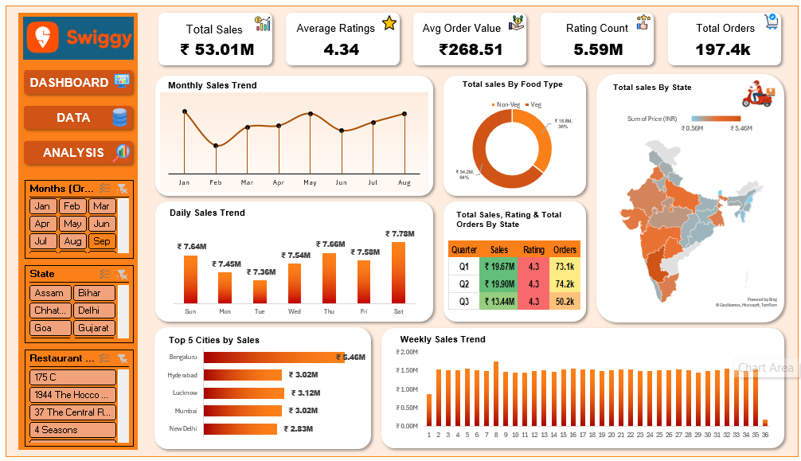

## Swiggy Sales Data Analysis Dashboard (Excel)
## 📊 Project Overview**

This project is an interactive Excel dashboard built to analyze and visualize Swiggy food delivery sales data. The dashboard provides insights into sales trends, top-performing cities, food category performance, and state-wise sales distribution.

The goal of this project is to demonstrate data analysis and dashboard creation using Microsoft Excel, including pivot tables, charts, and interactive data visualization.

## 🚀 Features
- The dashboard includes the following analytics:
- Monthly Sales Trend – View how sales change month by month.
- Daily Sales Trend – Identify patterns in daily orders.
- Total Sales by Food Type – Compare performance of different food categories.
- Total Sales by State – Analyze geographic sales distribution.
- State Sales Map Visualization – Visual representation of sales across states.
- Top 5 Cities by Sales – Identify the cities generating the highest revenue.
- Weekly Sales Analysis – Understand weekly ordering patterns.

## 📂 Dataset Information
- The dataset includes the following key fields:
- State – State where the order was placed
- City – City of the order
- Order Date – Date of the order
- Food Category – Type of food ordered
- Price (INR) – Price of the order
- Rating – Customer rating of the order
- Rating Count – Number of ratings received
- This data is used to generate various analytical insights and visualizations.

## 🛠 Tools Used
- Microsoft Excel
- Pivot Tables
- Pivot Charts
- Slicers
- Data Cleaning
- Dashboard Design
- Map Visualization

## 📈 Dashboard Components
- The Excel file contains multiple sheets:
- Dashboard – Main visual dashboard
- Monthly Trend – Sales trend by month
- Daily Sales Trend – Sales trend by day
- Total Sales by Food Type
- Total Sales by State
- Top 5 Cities
- Week by Sales
- Swiggy Data – Raw dataset used for analysis

## 🎯 Key Insights You Can Extract
- Using this dashboard, users can:
- Identify high-performing cities
- Track sales trends over time
- Compare food category performance
- Understand regional demand patterns
- Monitor customer rating trends

## 📌 How to Use
- Download the Excel file from this repository.
- Open it in Microsoft Excel (recommended Excel 2016 or later).
- Navigate to the Dashboard sheet.
- Use filters and slicers to explore different insights.

## 📷 Dashboard Preview

## Example:
## 📚 Learning Purpose
- This project is useful for:
- Practicing Excel Data Analysis
- Learning dashboard design
- Understanding data visualization techniques
- Building a portfolio project for data analytics

👤 Author
Parth

If you like this project, feel free to ⭐ the repository.
